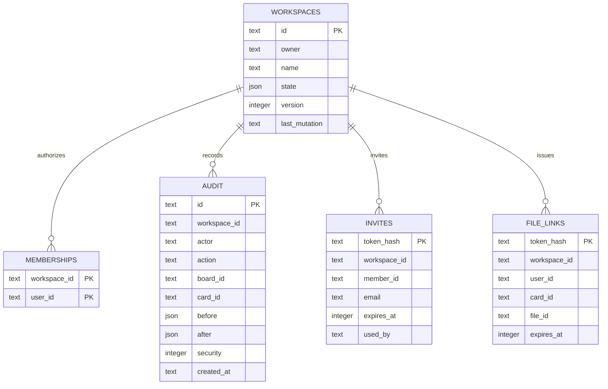

# ONUR Task Manager arxitekturasi

Ushbu nashr — T.Z. asosidagi ishlaydigan dastlabki web ilova. T.Z.dagi barcha qabul mezonlari bajarilgan deb hisoblanmaydi. To‘liq ishlab chiqarish tizimiga o‘tishdan oldin `coverage.md` dagi farqlar yopilishi kerak.

Frontend React/TypeScript va Vinext orqali ishlaydi. Barcha yozishlar `/api/v1/actions` yoki fayl endpointlariga boradi. Server har bir so‘rovda shaxsni, faol workspace a’zoligini, bazadagi rolni, doska va kartochka ACL’ini qayta tekshiradi. UI tugmalari qo‘shimcha qulaylik; xavfsizlik chegarasi emas.

Bu sinov nashri uchun platformadagi D1 (SQLite) va R2 tanlandi: ular tayyor hosting bilan integratsiyalangan. T.Z.da tavsiya etilgan PostgreSQL/Redis/MinIO, JWT va Docker Compose stacki ushbu nashrga tatbiq qilinmagan. Cloudflare server joylashuvi O‘zbekistonda ekaniga kafolat berilmaydi. Mahalliylashtirish va ishlab chiqarish infratuzilmasi buyurtmachi bilan kelishilishi kerak; bu hujjat huquqiy muvofiqlik xulosasi emas.

`state` JSON ichida rollar, a’zolar, doskalar, ustunlar, kartochkalar va bildirishnomalar saqlanadi. Bu dastlabki model atomar workspace o‘zgarishlarini soddalashtiradi. 1000 kartochka/200 faol foydalanuvchi talabi uchun normalizatsiyalangan jadvallar, inkremental so‘rovlar, indekslangan qidiruv, virtual ro‘yxatlar va yuklama testi kerak.

Versiya mos kelgandagina UPDATE bajariladi. O‘zgarish va audit bitta D1 batch tranzaksiyasida yoziladi. Tasodifiy `last_mutation` identifikatori audit/taklif/membership yon amallarini aynan muvaffaqiyatli yozuvga bog‘laydi. Eskirgan tahrir 409 bilan to‘xtaydi. Frontend 15 soniyada qayta o‘qiydi; har bir API so‘rov yangi huquqlarni darhol ishlatadi.

Huquq talqinlari: Owner barcha doskalarni boshqaradi; Admin uchun doskadagi aniq rol ustun. No access butun doskani yopadi va card ACL uni qayta ochmaydi. Private kartochkani tanlangan foydalanuvchilar, Owner va Board Admin ko‘radi. Lock barcha mazmun o‘zgarishlarini to‘xtatadi; Board Admin ACL orqali ochadi. Workspace Observer doskaga alohida kengaytiruvchi rol berilmaguncha faqat o‘qiydi. Kartochka override’i resurs amallariga ta’sir qiladi; doska boshqaruv huquqini ko‘tarmaydi.

Fayllar faqat ruxsatli endpointdan yuklanadi, hajmi 10 MB, kengaytma va asosiy signature tekshiriladi. ZIP asosidagi DOCX/XLSX ichki tarkibi va antivirus tekshirilmagan. Yuklab olish havolasi 5 daqiqa amal qiladi, faqat token xeshi bazada turadi. Har yuklab olishda amaldagi foydalanuvchi a’zoligi va kartochka huquqi qayta tekshiriladi. Fayllar `attachment` va `nosniff` bilan beriladi. Token egasi qisqa muddat faylni yuklay oladi; havolani maxfiy saqlash kerak.

Shaxs D1 `accounts` jadvalidagi email va PBKDF2 parol xeshi bilan tekshiriladi. Brauzerga HttpOnly, SameSite=Lax sessiya cookie’si beriladi; bazada tokenning faqat SHA-256 xeshi turadi. Har API so‘rovida faol hisob va ish maydoni a’zoligi qayta tekshiriladi. Birinchi Owner maxfiy `OTM_SETUP_SECRET` bilan yaratiladi. Platforma administratori hisobni ism, email va boshlang‘ich parol bilan yaratadi; xesh hisob bilan, a’zolik va audit workspace o‘zgarishi bilan bitta D1 tranzaksiyada saqlanadi. Parol yangilanganda barcha sessiyalar o‘chiriladi va foydalanilmagan tiklash tokenlari bekor qilinadi. Eski bir martalik email takliflari va parol tiklash havolalari ham API’da mavjud.

Foydalanuvchi yaratishdagi `boardRole` sozlamalarda saqlangan doska roliga ishora qiladi. U mavjud doskalarning `members` xaritasiga yoziladi va yangi doska yaratilganda ham qo‘llanadi. Rol nomlari `name`, `nameCyrl` va `nameRu` maydonlarida alohida saqlanadi; foydalanuvchi kiritgan matn avtomatik tarjima qilinmaydi. Eski standart rollar tarjimalari ko‘rsatish vaqtida qo‘llanadi, lekin standart rol nomi o‘zgartirilgan bo‘lsa eski tarjima ishlatilmaydi.
