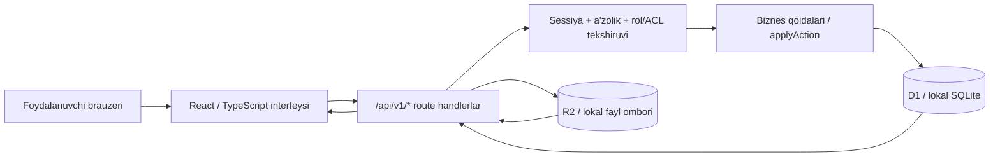
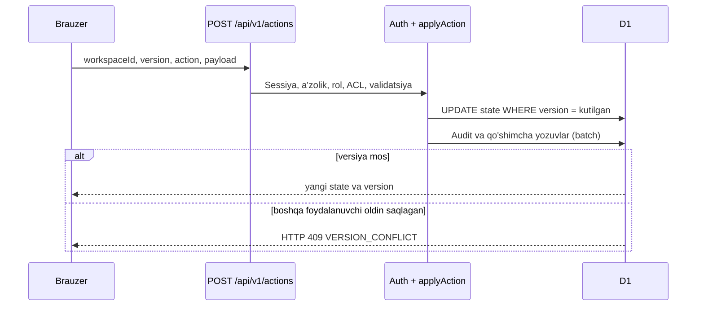

# ONUR Task Manager — dasturchilar uchun tizim xaritasi

**Holat sanasi:** 2026-09-28  
**Maqsad:** mavjud OTM kodini qabul qilish, davom ettirish va serverga chiqarish uchun texnik yo‘l xaritasi.  
**Manba:** ushbu hujjat `source/` ichidagi amaldagi kodni tavsiflaydi. Taklif qilingan o‘zgarishlar alohida belgilangan.

## 1. Tizim nimadan iborat?

OTM — ish maydonlari, doskalar, ustunlar va kartochkalar bilan ishlaydigan web ilova. Foydalanuvchi email/parol bilan kiradi. Administrator hisob yaratadi, parol va ruxsatlarni boshqaradi. Brauzer interfeysi API bilan ishlaydi; huquqning yakuniy tekshiruvi serverda bajariladi.



| Qatlam | Hozirgi texnologiya | Vazifasi |
|---|---|---|
| UI | React, TypeScript/TSX, CSS, Vinext/Vite | Sahifalar, Kanban, drag-and-drop, modal, uch til |
| API | `app/api/v1` ichidagi TypeScript route handlerlar | Auth, o‘qish, yozish, fayl, eksport |
| Qoidalar | `lib/model.ts`, `lib/actions.ts`, `lib/server.ts` | Ruxsat, validatsiya, state o‘zgarishi, audit |
| Baza | Cloudflare D1; lokalda Wrangler/SQLite | Hisoblar, sessiyalar, a’zolik, ish maydonlari, audit |
| Fayl ombori | Cloudflare R2; lokalda Wrangler emulyatsiyasi | Kartochkaga yuklangan fayl baytlari |
| Windows o‘rnatgichi | Node executable, Wrangler, PowerShell, NSIS | Shu kompyuterda lokal serverni ochish |

**Muhim farq:** `Setup.exe` brauzerda ochiladigan lokal serverni (`127.0.0.1:5181`) ishga tushiradi. Bu internetga nashr qilingan ko‘p foydalanuvchili server emas. O‘rnatgich ichidagi `node.exe` hozirgi Cloudflare Worker kodini lokal Wrangler muhitida yuritadi; backend hali oddiy Node.js serveriga ko‘chirilmagan.

## 2. Kod xaritasi

```text
source/
├─ app/
│  ├─ page.tsx, login/, setup/, reset/, invite/  # sahifalar
│  ├─ kanban-app.tsx, styled-select.tsx           # asosiy UI
│  ├─ brand.css, globals.css                     # vizual uslub
│  └─ api/v1/                                    # HTTP endpointlar
├─ components/ui/                               # qayta ishlatiladigan UI qismlari
├─ lib/
│  ├─ model.ts                                   # State turlari, rol va huquq
│  ├─ actions.ts                                 # biznes amallari va validatsiya
│  ├─ server.ts                                  # D1, audit, commit, API javoblari
│  ├─ auth.ts, password.ts                       # sessiya va parol
│  ├─ i18n.ts                                    # 3 til
│  └─ legacy.ts                                  # eski Owner identifikatorini ko‘chirish
├─ db/schema.ts, drizzle/*.sql                   # D1 sxemasi va migratsiyalar
├─ public/                                      # logo va statik fayllar
├─ scripts/windows/                             # Setup.exe va lokal launcher manbasi
├─ tests/                                       # auth va ruxsat testlari
├─ docs/openapi.json                            # HTTP API tavsifi
├─ docs/coverage.md                             # ishlangan va qolgan talablar
└─ package.json, vite.config.ts                  # build/dev sozlamalari
```

`components/ui/` umumiy interfeys kutubxonasidir. Ilovaning asosiy biznes mantiqi `app/kanban-app.tsx` va `lib/`da. Yangi amal qo‘shilganda tugmani yashirish bilan cheklanmasdan, `lib/actions.ts` va serverdagi ruxsat tekshiruvini ham yangilash kerak.

## 3. Ma’lumotlar modeli

D1 jadvallari `db/schema.ts` va `drizzle/0000…0002` migratsiyalarida aniqlangan.

| Jadval | Saqlanadigan ma’lumot |
|---|---|
| `accounts` | Email, parol xeshi, faol holat, platforma administratori belgisi |
| `sessions` | Sessiya tokenining xeshi va amal muddati |
| `workspaces` | Nomi, Owner, `version`, yangilangan vaqt, to‘liq `state` JSON |
| `memberships` | Hisobning qaysi ish maydoniga a’zoligi |
| `audit` | Amallar va xavfsizlik hodisalari tarixi |
| `invites` | Eski tokenli taklif oqimi |
| `password_resets` | Bir martalik parol tiklash tokenlari |
| `file_links` | 5 daqiqalik yuklab olish havolalari |
| `rate_windows` | So‘rovlar tezligini cheklash hisoblagichlari |

`workspaces.state` ichida `members`, `roles`, `boards`, `cards`, `notifications`, `name`, `description` va `nextNumber` saqlanadi. Doska ichida ustunlar va a’zolarning doska rollari bor. Kartochkada ustun, mas’ullar, sana, checklist, izohlar, fayl metama’lumoti, private/ACL, bog‘liqliklar va soatlar bor. Faylning haqiqiy baytlari `state` ichida emas: R2 obyekt kaliti `workspaceId/fileId` shaklida.

**Miqyos cheklovi:** har o‘zgarishda ish maydonining `state` JSON’i qayta saqlanadi va o‘qishda ko‘p ma’lumot bir yo‘la olinadi. Kodda 5000 kartochkadan oshishiga qarshi himoya bor; katta jamoa/yuklama uchun kartochkalarni alohida jadvallarga ajratish va yuklama sinovi kerak.

## 4. Asosiy ishlash oqimlari

### 4.1 Birinchi Owner va login

1. Bo‘sh bazada `/api/v1/auth/setup` → `setupRequired: true`; foydalanuvchi `/setup`ga yo‘naltiriladi.
2. Birinchi Owner email, kamida 8 belgili parol va `OTM_SETUP_SECRET`ni kiritadi. Kalit parolni tiklash savoli emas; faqat dastlabki Owner yaratishga ruxsat beradi.
3. Server `accounts`, `workspaces`, `memberships` yozuvlarini yaratadi yoki bitta eski Owner identifikatorini ko‘chiradi. Birinchi Owner `platform_admin=1` bo‘ladi.
4. Keyingi login `accounts`dagi email va parol xeshini tekshiradi, faol a’zolikni talab qiladi va `otm_session` HttpOnly cookie beradi. Sessiya odatda 7 kun amal qiladi; bazada tokenning o‘zi emas, SHA-256 xeshi turadi.
5. Logout sessiyani bazadan o‘chiradi. Administrator parolni yangilasa, foydalanuvchining barcha sessiyalari tugatiladi.

Parol PBKDF2-SHA-256 (600 000 iteratsiya, alohida salt) bilan xeshlanadi. Login urinishlari va umumiy API so‘rovlari cheklangan. Yozuvchi so‘rovlar Origin/`Sec-Fetch-Site` orqali cross-site tekshiruvdan o‘tadi.

### 4.2 Administrator foydalanuvchi yaratishi

1. Doska rollari va uch tildagi nomlari sozlamada tayyorlanadi.
2. Platforma administratori ism, email, boshlang‘ich parol, bo‘lim va doska rolini tanlaydi.
3. `member.create` hisobni `accounts`ga, a’zolikni `memberships`ga va doska rolini mavjud doskalarga yozadi. Yangi doska yaratilganda ham a’zoning `boardRole` qiymati qo‘llanadi.
4. Taklif xati mahalliy email dasturida **tayyorlanadi**; SMTP/API mavjud emasligi sababli server xatni avtomatik yubormaydi. Parol xatga qo‘shilmaydi.
5. Administrator hisobni bloklashi, rolini o‘zgartirishi, sessiyalarini tugatishi yoki parolni o‘zi belgilashi mumkin.

### 4.3 Doska/kartochka o‘zgarishi



Kanban ustunini surish `column.reorder`, kartochkani ustun ichida yoki boshqa ustunga surish `card.reorder` amaliga olib keladi. Server rolni, kartochka ko‘rinishini, target ustunni, WIP/lock shartlarini tekshiradi. UI odatda 15 soniyada serverdan qayta o‘qiydi; real vaqt WebSocket hali yo‘q.

### 4.4 Fayl yuklash/yuklab olish

Yuklash `POST /api/v1/files` orqali multipart yuboriladi. Maksimal hajm 10 MB; kengaytma va asosiy fayl imzosi tekshiriladi. Server avval doska/kartochka huquqini tekshiradi, baytlarni R2ga yozadi, so‘ng fayl metama’lumotini `state`ga commit qiladi. Commit xato bo‘lsa, yozilgan obyektni o‘chirishga urinadi. Yuklab olishda `GET /api/v1/files` 5 daqiqalik tokenli URL beradi; `GET /api/v1/download` amaldagi ruxsatni yana tekshiradi. DOCX/XLSX ichki tarkibi va antivirus tekshiruvi hali yo‘q.

## 5. Ruxsatlar tartibi

1. Foydalanuvchi hisobining faol holati va ish maydoni a’zoligi.
2. Workspace roli: `owner`, `admin`, `member`, `guest`, `observer`.
3. Doska roli: `board-admin`, `editor`, `contributor`, `commenter`, `viewer`, `none` yoki sozlamada yaratilgan rol.
4. Doska visibility, arxiv holati, ustun lock/WIP va kartochkaning private/allowed/ACL/lock qoidalari.
5. Har so‘rovda serverdagi `can()`/`canManage()` tekshiruvi; UI tugmalari faqat qulaylik uchun.

Owner oxirgi faol Owner bo‘lsa, uni pasaytirish/bloklash rad etiladi. Xavfsizlik amallari auditga yoziladi. Private kartochka faqat ruxsatli foydalanuvchi, Owner yoki Board Admin uchun ko‘rinadi. `visibleState()` API javobidan ruxsatsiz doska va kartochkalarni olib tashlaydi.

## 6. HTTP API qisqa xaritasi

| Endpoint | Vazifa |
|---|---|
| `GET/POST /api/v1/auth/setup` | Dastlabki Owner zarurligini bilish va uni yaratish |
| `POST /api/v1/auth/login`, `/logout`, `/reset` | Kirish, chiqish, token orqali parolni tiklash |
| `GET /api/v1/workspace` | Ruxsatli ish maydoni, versiya, filtrlangan state, faoliyat |
| `POST /api/v1/actions` | Asosiy yozuvchi amallar: workspace, board, column, card, member, role va boshqalar |
| `GET /api/v1/cards` | Ruxsatli kartochkalarni qidirish, filtrlash, sahifalash |
| `POST/GET /api/v1/files` | Fayl yuklash va qisqa muddatli download URL olish |
| `GET /api/v1/download` | Token va joriy huquq bilan faylni olish |
| `GET /api/v1/export` | Ruxsatli doskaning CSV eksporti |
| `POST /api/v1/invites/accept` | Eski tokenli taklif oqimi |
| `GET /api/v1/openapi` | API tavsifi |

Asosiy amal shakli:

```json
{
  "workspaceId": "<workspace-id>",
  "version": 12,
  "action": "card.reorder",
  "payload": {
    "id": "<card-id>",
    "columnId": "<target-column-id>",
    "targetId": null,
    "after": false
  }
}
```

`version` eskirgan bo‘lsa HTTP 409 qaytadi; mijoz yangi state’ni olib, foydalanuvchiga ziddiyatni ko‘rsatishi kerak. Boshqa tipik javoblar: 400 validatsiya, 401 login talab qilinadi, 403 huquq yo‘q, 429 tezlik cheklovi, 500 ichki xato. Batafsil kontrakt: `docs/openapi.json`; ayrim auth route’lar uchun route kodini ham ko‘ring.

## 7. Uch til

Interfeys `uz-Latn`, `uz-Cyrl`, `ru` tillarini qo‘llaydi. Asosiy matnlar o‘zbek lotincha, tarjima `lib/i18n.ts`da. Til tanlovi brauzer `localStorage`idagi `onur-locale`da saqlanadi. Sozlamada yaratiladigan rol nomlari `name`, `nameCyrl`, `nameRu` maydonlarida alohida kiritiladi; foydalanuvchi yozgan matn avtomatik tarjima qilinmaydi.

**Qolgan ish:** ba’zi ruscha kalit topilmasa, matn o‘zbek lotincha qolishi mumkin. Barcha UI/xato xabarlarini to‘liq kataloglash, yetishmayotgan tarjima uchun avtomatik tekshiruv va uch tilda qabul sinovi tavsiya etiladi.

## 8. Lokal ishga tushirish va ma’lumot joyi

**Manba kod bilan:** Node.js 22.13+, `npm ci`, `npm run build`, uch SQL migratsiya, `.dev.vars` ichida `OTM_SETUP_SECRET`, so‘ng `npm run dev`. To‘liq buyruqlar `README.md` va `docs/deployment.md`da. Lokal dev manzili `http://127.0.0.1:5173/`; D1/R2 holati odatda `source/.wrangler/state`da.

**Windows o‘rnatgichi:** `ONUR-Task-Manager-Setup.exe` Node va lokal runtime’ni o‘z ichiga oladi. Dastur `%LOCALAPPDATA%/Programs/ONUR Task Manager`, foydalanuvchi ma’lumoti `%LOCALAPPDATA%/ONUR Task Manager` ichida. Manzil `http://127.0.0.1:5181/`. Birinchi ishga tushishda migratsiyalar va `setup-key.txt` yaratiladi. Dasturni olib tashlash ma’lumot papkasini o‘chirmaydi.

Bu ikki lokal muhitning bazasi **alohida**. Ushbu kompyuterda 2026-09-28 kuni eski lokal baza o‘rnatilgan versiyaga bir marta ko‘chirilgan; yangi `Setup.exe` buni avtomatik qilmaydi. Jonli SQLite/R2 fayllarini ko‘chirishdan oldin serverni to‘xtatish, zaxira olish va akkaunt/ish maydoni/fayl tekshiruvini qilish kerak. `.dev.vars`, `setup-key.txt`, bazalar va foydalanuvchi fayllarini manba kod arxiviga qo‘shmang.

## 9. Internetga chiqarish: hozirgi holat va qaror

**Hozirgi holat:** backend `cloudflare:workers`, D1 va R2 bindinglariga bog‘langan; build Vinext/Vite va Sites integratsiyasidan foydalanadi. Lokal Wrangler serverini internetga ochish production deploy hisoblanmaydi. Production D1/R2, haqiqiy binding IDlari, `OTM_SETUP_SECRET`, domen/HTTPS, ma’lumot ko‘chirish, monitoring, backup va xavfsizlik qabul sinovi tayyor emas.

**Variant A — hozirgi stackni davom ettirish:** Cloudflare Worker/Sites mos joylashuvini, D1 va R2ni sozlash; migratsiyalarni remote bazaga qo‘llash; maxfiy kalitlarni secret sifatida saqlash; domen va HTTPS; mavjud lokal ma’lumotni tekshiruv bilan ko‘chirish. Tashqi hosting ruxsatlari va joylashuv talablari alohida tasdiqlanadi.

**Variant B — o‘z VPS’ingizda Node.js backend:** React/TypeScript UI va biznes qoidalarining katta qismini saqlab, `cloudflare:workers`/D1/R2 bog‘liqliklarini Node server, tanlangan SQL baza va obyekt saqlash adapterlariga ko‘chirish. Migratsiya skriptlari, sessiya/cookie, fayl va ruxsat oqimi qayta sinovdan o‘tadi. Bu faqat hosting sozlamasi emas, alohida ishlab chiqish loyihasi. Baza va fayl omborini tanlashdan oldin foydalanuvchi soni, ma’lumot joylashuvi va backup talabi belgilanadi.

## 10. Dasturchilar uchun qabul va keyingi ishlar

1. **Kod va ma’lumotni ajrating:** `source/` va maxfiy/foydalanuvchi ma’lumotlarini alohida saqlang; mavjud bazani zaxiralang.
2. **Lokal muhitni qayta ko‘taring:** migratsiyalarni faqat bo‘sh yoki tegishli sxemaga qo‘llang; Owner/login, doska va fayl oqimini tekshiring.
3. **Regression:** `node --test tests/permissions.test.mjs tests/auth.test.mjs`, `npx tsc --noEmit`, `npm run build`; auth/huquq/fayl uchun alohida HTTP sinovi. `docs/validation.md` avvalgi natijalar, yangi deploy uchun yangidan tekshirish kerak.
4. **Production qarorini yozma tasdiqlang:** Cloudflare yoki VPS/Node; domen, DB, fayl ombori, email provayderi, ma’lumot joylashuvi, backup/restore va javobgar shaxs.
5. **Yetishmayotgan ishlar:** avtomatik email/SMTP, tashqi backup, monitoring, barcha UI tarjimalari, antivirus/fayl tekshiruvi, haqiqiy mobil drag-and-drop va yuklama sinovi. To‘liq ro‘yxat `docs/coverage.md`da.

**Topshirish uchun asosiy fayllar:** `source/` kodi, `README.md`, ushbu hujjat, `docs/openapi.json`, `docs/coverage.md`, migratsiyalar va alohida xavfsiz kanal orqali beriladigan production secretlar. `Setup.exe` faqat Windows lokal ishlatish uchun; u server deploy o‘rnini bosmaydi.
